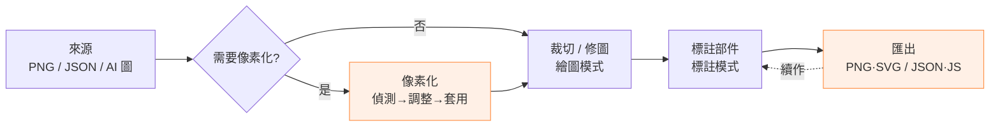

# 像素畫工具 — UI/UX 改版設計文件（桌面版）

> 版本 2.0 · 2026-08-16（取代 v1.0）
> **範圍：桌面瀏覽器**，視窗寬 ≥ 900px；主要驗證於 1440×900，兼顧 1280×720 筆電。**行動版暫不處理**（v1.0 的行動版建議濃縮在附錄 A 備查）。
> 依據：逐行閱讀 `index.html`、`css/style.css`、`js/ui.js`、`js/store.js`、`js/render.js`；在瀏覽器實機操作、量測 DOM 尺寸 / 距離 / 對比 / 樣式規則數。

---

## 0. 怎麼讀這份文件

| 章 | 內容 | 適合誰 |
|---|---|---|
| 1 | 一頁看完：保留的優點、桌面版最痛的 12 個問題 | 快速抓重點 |
| 2 | 七條桌面版設計原則 | 之後每次改 UI 的依據 |
| 3 | **使用者與使用動線**：兩種使用者、五條任務流程（步驟數 / 摩擦點 / 改版後）、滑鼠與視線的移動量測、首次使用的注意力路徑 | 想懂「使用者怎麼在畫面上移動」 |
| 4 | **視覺邏輯**：層級、分組、色彩語意、字級 / 間距 / 圓角 / 圖示盤點、狀態矩陣、可供性 | 想懂「為什麼看起來這樣」 |
| 5 | 逐模組審視（17 個模組，附量測） | 想知道每個角落該改什麼 |
| 6 | **改版設計**：資訊架構、版面藍圖、元件規格、Design Token、桌面互動細節（滑鼠 / 鍵盤地圖）、文案 | 要動手改的人 |
| 7 | 路線圖 P0 / P1 / P2（對應檔案） | 排程 |
| 8 | 驗收檢核表 | 改完自我檢查 |
| 附錄 A | 行動版備忘（暫不實作） | 日後 |

---

## 1. 診斷總覽

### 1.1 做得好的地方（改版要保留）

- **畫布優先**：畫布鋪滿、面板浮在上面，工作區最大化；毛玻璃面板質感一致。
- **依模式收納**：標註 / 繪圖只顯示各自的工具與選項。
- **快捷鍵跨模式自動切換**（標註模式按 `D` 直接進繪圖）。
- **貼上即載入**：任何地方 `Ctrl+V`；格式錯會開視窗並指出「第 N 列第 M 格」。
- **失敗前先擋**：>64×64 停用文字格式、PNG 倍率超上限就停用按鈕。
- **自動保存**到 localStorage；連續新增部件時焦點留在輸入框，打字很順。
- **對比度基礎良好**：主要文字對面板 ≥ 5.4:1、主按鈕 8.1:1。
- 像素化管線的說明與數據（重建誤差、實際格寬）可判讀。

### 1.2 桌面版最痛的 12 個問題（依影響排序）

| # | 問題 | 影響 | 證據 / 量測（1440×900） | 嚴重度 |
|---|---|---|---|---|
| 1 | **沒有重做（Redo）** | 復原多按一步就回不去，60 步 undo 形同單向 | `store.js` 只有 `undoOnce`；全專案無 redo | 高 |
| 2 | **破壞性操作無防護** | 「關閉這張」一鍵刪圖 + 標註 + 復原堆疊，**不可復原、無確認**，且與「清空這張的標註」並排、同樣式 | `closeCurrent()` 直接 `splice` 並 `delete undo[n]` | 高 |
| 3 | **動線太長、鍵盤替代失靈** | 換部件要從畫布到右欄（627px）、換工具到左欄（642px）、右欄 ↔ 左欄 1175px；唯一替代 `1–9` 在列上**沒有編號**；**新增部件後焦點留在輸入框，所有快捷鍵失效**，要先點別處（點畫布會誤畫一格） | 量測中心距；實測 `W` 在輸入框內不切工具、`Esc` 不離開 | 高 |
| 4 | **首屏視覺焦點錯置** | 沒開圖時最亮的是橘色「筆刷」與橘色「下載 .json」，但下載 / 複製 / 清空 / 關閉 四顆**按了靜默無反應**、載入標註與「+」要到事後才 toast；真正的入口（開啟 / 貼上 / 像素化）是灰底小鈕、與「載入標註」並排無差別 | 實測六顆皆 `disabled=false`；`doDownload` 等以 `if (!store.has()) return` 靜默返回 | 高 |
| 5 | **顏色語意過載** | `--accent` 橘出現在 **25 條規則、6 種意義**（品牌 / 作用中工具 / 作用中部件 / 主要按鈕 / 焦點框 / Toast / 裁切框 / 拖放外框）；紅同時是錯誤與鏡射差異；洋紅是偵測格線 | 樣式表統計 | 中 |
| 6 | **部件辨識力弱** | 新部件一律 `#000`；列上無編號；「顯示」與「作用中」兩層狀態靠勾勾 + 橘框；控制項 12–20px、把手對比 2.78:1 | `DEFAULT_PART_COLOR`；量測 | 中 |
| 7 | **畫布回饋不足** | 筆刷 1–6px 無範圍預覽；格線 `rgba(255,255,255,.10)` 在淺色像素上看不見；hover 反白純白在白像素失效；魔棒 / 同色全選無 hover 預覽 | `render.js`；8×8 棋盤實測無格線 | 中 |
| 8 | **回饋系統薄弱** | Toast 固定 1.5 秒、無 `aria-live`、與裁切列同在底部中央（單圖時相疊）、無「復原」動作 | `toast()`；量測 | 中 |
| 9 | **隱藏操作無任何可見提示** | 右鍵平移、Ctrl+V、1–9、裁切 Enter/Esc、貼上 Ctrl+Enter、格式停用原因……只在 README；**工具鈕全部沒有 tooltip** | grep 無 `title` | 中 |
| 10 | **版面空洞** | 繪圖模式右欄 279×562 空白；左欄「顯示」被 `margin-top:auto` 推到底，離筆刷 298px | 量測 | 中 |
| 11 | **像素化視窗** | 10 個控制項擠一列無分組；原生像素圖時左預覽整片洋紅；顏色數預設 24 但圖只有 5 色、「0 = 不減色」沒寫；偵測時主執行緒凍結、無進度 | 實測 16×16 | 中 |
| 12 | **排版系統不一致** | 字級 **7 種**（9–15px）、間距 **12 種**（1–14px）、圓角 **9 種**、圖示 **4 種風格**；標題列內容需 ≈938px，視窗窄於 ~940px（半螢幕瀏覽器）按鈕文字就逐字直排溢出 | 樣式表統計；量測 | 中 |

其他（低）：貼上視窗錯誤不定位到行；無障礙缺口（對話框無 `role=dialog` / 焦點陷阱、canvas 無標籤、4 個輸入無 label、無 reduced-motion / 淺色主題）。

### 1.3 三個維度的總評

| 維度 | 分數 (1–5) | 一句話 |
|---|---|---|
| 使用動線 | 2.5 | 單一任務可完成，但跨面板往返多、鍵盤替代不可見、無圖時亂按無回應 |
| 視覺邏輯 | 3 | 風格統一、質感好；但焦點錯置、同色多義、尺度沒有系統 |
| 使用者體驗 | 3 | 事前防錯做得好；事後救援（Redo / 確認 / 可復原）與回饋不足 |

---

## 2. 設計原則（桌面版）

1. **滑鼠與鍵盤雙軌**：每個高頻動作都要有「就近點擊」與「不離開畫布的按鍵」兩種做法，且按鍵在畫面上看得到。
2. **動線最短**：高頻控制項離畫布 ≤300px 或有鍵盤 / 右鍵替代；單程 >600px 的往返必須有替代。
3. **單一焦點**：任何時刻只有一個最強視覺焦點，而且它就是「下一步該做的事」（無圖 = 開啟入口；有圖 = 作用中部件 / 工具）。
4. **一色一意**：橘 = 品牌與主要動作；藍 = 選取 / 焦點；紅 = 危險 / 錯誤；黃 = 警告；綠 = 成功；疊加層各自固定一色。
5. **每個破壞性動作都可反悔**：Redo；刪除 / 清空 / 關閉走「可復原 Toast」或確認；永不一鍵不可逆。
6. **先給好預設，再給控制**：像素化把「自動偵測 → 套用」放最前面，進階摺疊。
7. **畫布任何一邊不被遮**：面板可以浮，但裁切列不壓畫布底列、Toast 不壓裁切列。

---

## 3. 使用者與使用動線

### 3.1 使用者輪廓

| | A · 技術美術 / 開發者（本專案作者型） | B · 像素美術 |
|---|---|---|
| 目標 | AI 生成 → 像素化 → 修圖 → 標註部件 → JSON 進遊戲 / 程式 | 拿現成 PNG 修幾格、匯出放大 PNG / SVG |
| 頻率 | 高，一次處理多張 | 低、偶發 |
| 操作偏好 | 鍵盤重度、期待右鍵 / 修飾鍵慣例（Alt 滴管、Space 平移、Ctrl+滾輪縮放） | 滑鼠為主、靠看得到的按鈕 |
| 最在意 | 步驟數、批次、資料格式正確 | 看得懂、不會弄壞、匯出漂亮 |

改版要同時服務兩者：**A 靠鍵盤地圖與右鍵快選，B 靠可見的入口卡片、tooltip、狀態列提示**。

### 3.2 五條主要動線

步驟數 = 點擊 + 按鍵（不含塗抹本身）。「改版後」對應第 6 章的設計。

#### F1 · AI 圖 → 乾淨像素圖 → 匯出 PNG

| | 現況 | 摩擦點 | 改版後 |
|---|---|---|---|
| 步驟 | ① 拖入 PNG ② 標題列「像素化」③ 等偵測（無進度）④ 看左右預覽、可能調 7 個數字欄 ⑤ 套用 ⑥ `C` 裁切、拖曳、`Enter` ⑦ `D` 進繪圖 ⑧ 點調色盤取色 ⑨ 塗 ⑩ 到右下「下載 .json ▾」開選單 ⑪ 選 .png ⑫ 選倍率 ⑬ 下載 ＝ **≥13 步** | 像素化入口不顯眼；偵測期間像當機；參數無分組；1:1 圖預覽全洋紅；匯出預設 `.json`（>64 時才自動改 PNG）、格式藏在選單裡；鏡射差異開關在左下角、離工具遠 | 空狀態卡片「✨ 像素化 AI 圖」直達；視窗三步驟 + 進度 + 好預設 → 套用；裁切八把手；繪圖模式匯出分頁預設 PNG、倍率就在旁邊 ＝ **≈8 步** |

#### F2 · 標註部件 → 匯出 JSON

| | 現況 | 摩擦點 | 改版後 |
|---|---|---|---|
| 步驟 | ① 拖入 ② 點右欄輸入框、打名稱 `Enter`（每個部件 1 次，焦點保留，很順）③ 想按 `W` 用魔棒 → **沒反應**（焦點在輸入框）→ 點畫布 → 誤畫一格 → `Ctrl+Z` ④ 塗 ⑤ 換部件：滑鼠到右欄點列（627px）或按 `1–9`（不知道誰是幾）⑥ 重複 ⑦ 下載 .json | 新增後快捷鍵失效；1–9 不可見；每個新部件都黑色、要各自點色塊換色；hover 列才知道範圍；沒有「還剩多少沒標」 | `Esc` 離開輸入框（狀態列提示）；列上編號徽章；自動配色；`Alt+點` 吸取游標下的部件；右鍵快選選單；摘要列「已標註 87%・未標註 34 格 [反白]」 |

#### F3 · 續作

| | 現況 | 摩擦點 | 改版後 |
|---|---|---|---|
| 步驟 | 重開頁面 → 自動還原 + Toast；或開同尺寸 PNG → 「載入標註 .json」 | 「載入標註」無圖時可按、按了才 toast；尺寸不符只 toast 1.5 秒；不知道目前是否已保存 | 無圖時停用 + tooltip；錯誤 Toast 依字數延長並含怎麼辦；狀態列「已保存 ✓」 |

#### F4 · 快修幾格

| | 現況 | 摩擦點 | 改版後 |
|---|---|---|---|
| 步驟 | `D` → `I` 滴管點色 → `D` → 塗 → 下載 PNG | 取色要來回切工具（桌面慣例是 `Alt+點`）；筆刷範圍看不到；右欄整片空白沒地方放顏色 | 繪圖工具中 `Alt+點` = 暫時滴管；筆刷輪廓；右欄「顏色」分頁（目前 / 上一色、調色盤 24px、最近用色） |

#### F5 · 多圖批次

| | 現況 | 摩擦點 | 改版後 |
|---|---|---|---|
| 步驟 | 一次選多檔 → 底部縮圖列切換 → 每張各自標註 / 匯出 | 單張時看不到縮圖列、不知道可多張；切圖後**作用中部件與顯示集合重設**（`resetSel`）；縮圖 54px、檔名 9px；沒有每張的 × 與標註狀態；沒有「全部匯出」 | 右欄「圖片」分頁（縮圖 40 + 檔名 12px + 尺寸 + 標註徽章 + ×）；記住每張的作用中部件；P2 加「匯出全部（zip）」 |

#### 主管線一覽



### 3.3 滑鼠與視線的移動路徑（量測）

1440×900 各區塊中心點：左欄工具 (93, 132)、左欄「顯示」(93, 725)、畫布 (641, 466)、右欄部件列 (1268, ≥130)、右欄下載 (1225, 720)、標題列復原 (1379, 23)、像素化 (564, 23)。

| 往返 | 單程距離 | 觸發頻率（F2 標註時） | 現況替代 | 評語 |
|---|---|---|---|---|
| 畫布 ↔ 部件列 | ≈627px | **每換一次部件**（最高） | `1–9`（不可見） | 最需要縮短 |
| 畫布 ↔ 工具 | ≈642px | 每換一次工具（高） | `B/W/S/E`（鈕上有 kbd，可見 ✓） | 鍵盤可用，但新增部件後失效 |
| 畫布 ↔「顯示」開關 | ≈606px | 中（想看原圖時） | 無 | 需要 `H` 暫看原圖 |
| 部件列 ↔ 工具 | ≈1175px | 中 | — | 兩欄互跨最貴 |
| 畫布 ↔ 復原 | ≈861px | 高 | `Ctrl+Z` ✓ | OK；缺 Redo |
| 畫布 ↔ 下載 | ≈630px | 低（一次） | 無 | 可接受 |

現況動線是「Z 字」：右欄選部件 → 畫布塗 → 左欄換工具 → 畫布 → 右欄……全靠滑鼠標註 5 個部件、換 3 次工具，來回累計 **≈10,000px**（5×2×627 + 3×2×642）。

**改善策略（不改變左工具 / 右部件的標準編輯器格局）**
1. **鍵盤補齊並可見**：列上編號 `1–9`、`Alt+1–9` 之後擴充；`Esc` 離開輸入框；`H` 按住 = 暫看原圖；`[` `]` 筆刷。
2. **右鍵快選**：在畫布上**右鍵點一下（不拖曳）**彈出游標處的選單：部件（帶色塊與編號）+ 工具；右鍵**拖曳**仍是平移。
3. **`Alt+點` 吸取**：標註模式吸取游標下的部件成為筆刷目標；繪圖模式吸取顏色（免切滴管）。
4. **畫布左上角脈絡標籤（HUD）**：`✎ 筆刷 1px · ■ 劍刃 ①`，唯讀、半透明；讓眼睛不必離開畫布就確認目前狀態，點它 = 開快選。
5. 「顯示」開關上移到工具下方（去掉 `margin-top:auto`），並提供 `H`。

### 3.4 首次使用的注意力路徑

無圖時畫面上最亮的元素依序：① 左上橘色「筆刷」② 右下橘色「下載 .json」③ 標題列橘色「工具」二字 → 三個焦點都**不是**使用者現在能做的事（下載按了靜默無反應）；正確入口「開啟圖片 / 貼上 JSON / 像素化」是灰底小鈕、與「載入標註」並排無差別；畫布中央只有一行灰字。

目標：無圖時**唯一**焦點是畫布中央的三張入口卡片（見 6.2），其餘面板降到 60% 不透明、下載 / 複製 / 清空 / 關閉 / 載入標註 / + 皆 `disabled`（像素化保留可按，因為它自己就是入口）；有圖後焦點移到作用中部件 / 工具。

---

## 4. 視覺邏輯

### 4.1 視覺層級

| 層 | 應該是什麼 | 現況 |
|---|---|---|
| 1 · 主體 | 畫布 + 「我現在正在用什麼」（工具、部件、顏色） | 畫布 ✓；作用中工具是**整塊橘底**、作用中部件是橘框、下載是橘底 → 三個等重焦點互搶 |
| 2 · 操作面板 | 左工具、右部件、匯出 | ✓ 但繪圖模式右欄空、左欄中段空 |
| 3 · 輔助 | 狀態、提示、快捷鍵、統計 | 分散在游標 hint / 標題列膠囊 / toast；沒有固定的狀態區 |

處方：作用中工具改「淡橘底 + 左緣 3px 橘條 + 粗體」，作用中部件同樣式（形成「同一件事的兩個面」）；主要按鈕保留橘底但只在**該面板的主要動作**用一顆；無圖時主要按鈕 `disabled`。

### 4.2 分組邏輯（Gestalt：鄰近 / 相似）

| 現況錯置 | 為什麼怪 | 新分組 |
|---|---|---|
| 「裁切」在繪圖工具裡、「像素化」在標題列 | 兩者都是**影像變形**（改尺寸、改整張），不是「畫」 | 左欄新增「影像」群組：裁切、像素化（之後：翻轉 / 位移 / 畫布尺寸） |
| 「清空這張的標註」與「關閉這張」並排在匯出區下方 | 一個可復原、一個不可復原；都不是匯出 | 清空 → 部件分頁的「⋯」選單；關閉 → 圖片分頁每張的 × / 檔案選單 |
| 「載入標註 .json」與「開啟圖片」並排 | 一個是匯入資料、一個是開檔 | 檔案 ▾ 選單：開啟圖片… / 貼上 JSON·JS… / 匯入標註… |
| 「可標註透明區」在「顯示」群組 | 它是**規則**不是顯示 | 移到筆刷選項下（標註模式） |
| 「鏡射差異」開關與「對稱軸」數字在顯示群組、離繪圖工具遠 | 是繪圖時的檢查工具 | 繪圖模式工具選項區 |
| 匯出「資料 JSON/JS」與「圖片 PNG/SVG」共用一顆按鈕 | 給程式吃 vs 給人看，用途不同 | 匯出分頁分兩區 |

### 4.3 色彩語意

現況 `--accent` 出現在 25 條規則，承載 6 種意義；且 `accent-color` 讓核取方塊與滑桿也是橘，導致「勾選 = 作用中」的錯覺。

| 語意 | Token | 用在 | 不用在 |
|---|---|---|---|
| 品牌 / 主要動作 | `--accent` | 標題品牌字、每面板一顆主要按鈕、作用中工具與部件的**左緣條 + 淡底** | 焦點、Toast 底色、拖放外框、核取方塊 |
| 選取 / 焦點 | `--focus` `--select` | 鍵盤焦點 ring、拖放外框、多選 | — |
| 危險 / 錯誤 | `--danger` | 錯誤文字、危險按鈕、刪除 hover | 鏡射差異 |
| 警告 | `--warn` | 誤差偏高、配額不足 | — |
| 成功 / 資訊 | `--success` `--info` | Toast 左側色條、已保存 ✓ | — |
| 疊加層 | `--ov-*` | 格線（雙色）、裁切遮罩 + 框、鏡射差異（洋紅斑馬）、偵測格線（洋紅）、筆刷輪廓（黑白） | — |

疊加層要有圖例：開關旁 8px 色塊（鏡射差異 ■ 洋紅）。

### 4.4 字級

現況 7 種：9（縮圖名）、10（`.label`、色碼）、11（`.muted`、kbd、格數、裁切標籤、像素化標籤、hint）、12（膠囊、工具名、核取、選單、輸入）、13（按鈕、部件名、Toast）、14（body）、15（空狀態、×）。

| 角色 | 新字級 | 用途 |
|---|---|---|
| 對話框標題 | 16 / 600 | 貼上、像素化、確認 |
| 內文 / 按鈕 / 部件名 | 13 | 預設 |
| 次要 / 標籤 / 核取 | 12 | 段落標籤（去掉 uppercase + letter-spacing）、說明 |
| 資料 / kbd / 徽章 | 11 mono | 座標、色碼、格數、快捷鍵 |

最小 11px；9 / 10 / 15 全部消失。

### 4.5 間距 / 圓角 / 尺寸

- 間距現況 12 種（1,2,3,4,5,6,7,8,9,10,12,14）→ **4 / 8 / 12 / 16 / 24**；面板內距 12、群組間 16、列內元素 8、圖示與文字 8。
- 圓角現況 9 種（0,4,6,7,8,9,10,14,99）→ **6（控制項）/ 10（列、選單）/ 14（面板、對話框）/ pill**。
- 控制項高度：主要按鈕 36、一般 32、分段 / 倍率 28、圖示鈕 28（列內）；模式切換現況 21px 高，是整個 app 最重要的狀態開關卻最小 → 32。
- 面板寬：左欄 150 → **168**（工具名不擠、快捷鍵靠右對齊有呼吸）；右欄 308 → **320**。

### 4.6 圖示

現況四種風格：工具 SVG 19px stroke 1.5 圓端；把手 12px 實心圓點；鉛筆 13px stroke 1.4；刪除是文字「×」15px；下拉箭頭 12px stroke 2。

規範：一套 20px（工具）/ 16px（列內、選單）線性圖示，stroke 1.5、圓端；刪除、眼睛、把手、箭頭、警告、成功皆 SVG；`aria-hidden` + 父元素 `aria-label`。

### 4.7 狀態矩陣

| 元件 | 預設 | hover | 作用中 / 選取 | 按下 | 停用 | 焦點（鍵盤） | 載入中 |
|---|---|---|---|---|---|---|---|
| 工具鈕 | `--fg-2` | `--surface-3` | 淡橘底 + 左緣條 + 600 | 底再深 4% | 40% + 無 hover | 2px `--focus` ring | — |
| 主要按鈕 | 橘底 | `--accent-hover` | — | 深 6% | 40% | ring | 圖示轉圈 + 文字「處理中…」 |
| 部件列 | 透明 | `--surface-2` | 淡橘底 + 左緣條 | — | — | ring（列） | — |
| 眼睛 / 圖示鈕 | `--fg-3` | `--fg-1` + 底 | `--fg-1` | — | 40% | ring | — |
| 輸入框 | `--surface-3` + 邊 | 邊亮 | — | — | 40% | 邊 `--focus` + ring | — |
| 分頁 | `--fg-3` | `--fg-1` | 底線 `--accent` + 600 | — | — | ring | — |

現況缺：按下、鍵盤焦點（文字欄 `outline:none` 只換 1px 邊）、載入中；作用中工具 hover 無變化。

### 4.8 可供性（affordance）修正清單

| 類型 | 現況 | 修正 |
|---|---|---|
| 看起來可按、其實不能 | 標題列檔名膠囊（chip 樣式） | 變成真的下拉（切換多圖）或改成純文字 |
| 能按、看不出來 | 部件色塊（只有 `title`）、色碼文字（不可編輯）、部件名（雙擊無效） | 色塊右下小三角、hover 出現「換色」提示；色碼可編輯；雙擊改名 |
| 能按、按了無效 | 無圖時下載 / 複製 / 清空 / 關閉（靜默）、載入標註 / +（事後 toast） | `disabled` + tooltip 原因 |
| 有手勢、沒暗示 | 右鍵平移、Space、Ctrl+V | stage 空白處 hover 游標 grab；狀態列提示；空狀態卡片寫 Ctrl+V |
| 停用原因藏在 tooltip | 格式選單劃掉 + `title` | 原因直接顯示在選單項下方小字 |

### 4.9 面板與層級

三層即可：面板（浮動、`--shadow-2`、毛玻璃）→ 選單 / Popover（`--shadow-2`、`--surface-2`）→ 對話框（遮罩 + `--shadow-3`）。Toast 在最上。HUD 標籤屬於畫布層（無陰影、半透明）。

---

## 5. 逐模組審視（桌面）

每節：**現況 → 問題 → 建議**。量測來自 1440×900、DPR 1.75。

### 5.1 標題列 `header`

**現況**：品牌 · 檔名膠囊 · 開啟圖片 / 貼上 JSON / 載入標註 .json / 像素化 · 縮放滑桿 · 復原。高 46px。

**問題**：內容需 ≈938px，視窗更窄就逐字直排溢出（`.filegrp button` 無 `nowrap`）；像素化是最獨特的功能卻和「開啟」同樣式；載入標註無圖可按；縮放只有滑桿（無貼合 / `Ctrl+滾輪` / `+ −`）；有復原無重做；膠囊像按鈕。

**建議**：三段式 —— 左「檔案 ▾ · ✨ 像素化（橘描邊）」、中「檔名 — 尺寸 ▾」、右「↶ ↷ · − 24× + ⛶ · ?」；全部 `nowrap`，寬度不足先收圖示、再進 ⋯。

### 5.2 空狀態 `#drop`

**現況**：一行灰字，只提到拖入 PNG；文案「開啟圖片…」與按鈕不一致。
**建議**：三張入口卡片（拖入 / 貼上 JSON·JS / 像素化 AI 圖）+ 範例圖 + 支援格式；卡片就是拖放目標；此時其他面板降不透明度、無效按鈕停用。

### 5.3 左側工具欄 `.rail`

**現況**：模式切換（21px 高）→ 工具（圖示 + 名 + kbd）→ 筆刷 → 「顯示」推到底。
**問題**：工具無 tooltip；顯示群組離筆刷 298px；裁切在繪圖工具裡；對稱軸列折行；`.label` uppercase/letter-spacing 對中文無效；切模式會同時換工具（可接受但要在 tooltip 說明）。
**建議**：順序改為 模式（32 高）→ 工具 → 工具選項（筆刷 / 顏色 / 可標註透明區 / 鏡射差異）→ 影像（裁切、像素化）→ 檢視（原圖 / 部件色 / 格線 圖示切換）；工具鈕 `title`；寬 168。

### 5.4 畫布 `#stage` / `#cv`

**現況**：整數倍縮放、右鍵 / 中鍵平移、格線每 8 格加粗、游標 hint。
**問題**：無筆刷輪廓；格線 / hover 在淺色失效；右鍵平移無提示；`Ctrl+滾輪` 未攔截 → 觸發瀏覽器整頁縮放；上限 48× 讓 8×8 只有 384px；沒有貼合鈕。
**建議**：筆刷輪廓（黑白雙線）；雙色格線；反相斑馬 hover；`Ctrl+滾輪` 以游標為中心整數倍縮放、`+ − 0`、`Space` 平移、貼合鈕；上限 `max(48, 可用寬/圖寬)`；HUD 標籤；右鍵點一下 = 快選選單。

### 5.5 繪圖模式（顏色 / 調色盤 / 鏡射差異）

**現況**：原生色票 + 色碼 10px + 圖片調色盤 16px 色塊；鏡射差異紅 55%；右欄空白。
**建議**：右欄「顏色」分頁（目前 / 上一色可交換、色碼可編輯、調色盤 24px 8 欄、最近 8 色）；`Alt+點` 滴管；鏡射差異改洋紅斑馬 + 狀態列「不對稱 N 格」；對稱軸可在畫布上拖。

### 5.6 裁切 `#cropbar`

**現況**：整張框住 → 拖或輸入 → Enter / 套用；範圍外壓暗；列浮在畫布底部中央。
**問題**：貼合 48× 時列壓住最底列 ~15px、有縮圖列時 29px（`fit()` 未扣列高）；Enter / Esc 未標示；沒有八把手；Toast 會疊上來。
**建議**：列停靠在狀態列位置；八把手 + 整框拖曳；數字欄 ↑↓ 微調；列上 `Enter 套用 · Esc 取消`。

### 5.7 部件清單 `aside` / `#parts`

**現況**：把手 · 勾選 · 色塊 · 名稱 · 格數 · 鉛筆 · ×；點列 = 筆刷目標；hover 反白；拖曳排序；1–9。
**問題**：控制項 12–20px、把手 2.78:1；黑色預設；無編號；兩層狀態難懂；刪除無提示；只能鉛筆改名；無完整度統計；清單區 511px 只放 ~12 列。
**建議**：部件列 v2（6.3.4）+ 摘要列 + 自動配色 + `Esc` 離開輸入框。

### 5.8 匯出區 `.asidefoot`

**現況**：分割按鈕「下載 .json ▾」+ 格式選單 + 複製；PNG 時倍率列。
**問題**：預設 JSON（繪圖模式常要 PNG）、不記格式；複製不說明格式；停用原因在 `title`；倍率鈕 21px；資料與圖片混在一顆鈕；無圖時可按。
**建議**：匯出分頁（6.3.5），依模式記格式，無圖停用。

### 5.9 破壞性操作

**現況**：清空（可 Ctrl+Z）與關閉（不可復原）並排、同樣式、無確認；刪部件可 Ctrl+Z 但無提示。
**建議**：關閉 → 圖片分頁的 × / 檔案選單 + 有標註或未匯出時確認；清空 / 刪部件 / 套用裁切 / 套用像素化 → 可復原 Toast 6 秒；危險鈕 `--danger` ghost。

### 5.10 多圖縮圖列 `#strip`

**現況**：≥2 張才出現、54px 縮圖、9px 檔名。
**建議**：右欄「圖片」分頁為主（縮圖 40 / 檔名 12 / 尺寸 / 標註徽章 / ×）；縮圖列可保留為快速切換，≥64px、檔名 11px；記住每張的作用中部件。

### 5.11 貼上 JSON / JS 視窗 `#modal`

**建議**：錯誤「⚠ 第 3 列第 2 格：… [跳到該行]」並在 textarea 選取該行；底部 `Ctrl+Enter 載入 · Esc 關閉`；標題下一行支援格式；「貼上範例」。

### 5.12 像素化視窗 `#pxmodal`

**現況 / 問題**：見 1.2 #11。
**建議**：三步驟版面（6.3.7）；1:1 時格線預設關且說明；顏色上限 = 實際色數上限、0 = 不減色；偵測 / 重算進 Worker + 進度 + 取消；套用固定右下。

### 5.13 回饋系統（Toast / Hint / 錯誤 / 進度）

**建議**：Toast 時長 = clamp(2s, 字數×80ms, 8s)、四種語意色條、動作鈕、`role=status`、右下堆疊、hover 暫停；錯誤 = 圖示 + 摘要 + 怎麼辦；>300ms 運算顯示進度；狀態列取代游標 hint（hint 保留為選項）。

### 5.14 快捷鍵與鍵盤

**現況**：B/W/S/E/D/I/X/C、1–9、Ctrl+Z、Enter/Esc（裁切）、Ctrl+Enter（貼上）；輸入框有焦點時全部失效且 Esc 不離開。
**建議**：完整鍵盤地圖見 6.5；`?` 面板；`Esc` 離開任何輸入框；格式選單 ↑↓；對話框焦點陷阱。

### 5.15 復原 / 重做

**建議**：Redo（`Ctrl+Shift+Z` / `Ctrl+Y`、↷）；每筆快照帶 label（「裁切 16×16 → 12×14」）顯示在 tooltip 與 Toast；P2 可加歷史面板。

### 5.16 視窗尺寸（桌面）

| 視窗 | 現況 | 目標 |
|---|---|---|
| ≥1181（1440×900、1920×1080） | 浮動面板、stage padding 184 / 342 | 左 168 / 右 320 / 狀態列 28；大螢幕放寬縮放上限 |
| 900–1180（1280×720、半螢幕） | 面板貼邊、右欄 280；**標題列 <940 直排溢出** | 標題列 nowrap + 收圖示 + ⋯；右欄可收合成 48px 圖示欄（`Tab` 或鈕）；面板內距 12 → 10 |
| 1366×768（常見筆電，仍走 ≥1181 版面） | 右欄清單只剩 379px（約 8 列）；左欄筆刷與顯示之間空洞 166px | 「顯示」上移；部件列 40 高；右欄底部匯出區改分頁後清單多出 ~90px |
| <900 | 上下堆疊（v1 行動版邏輯） | 暫不處理（附錄 A） |

### 5.17 無障礙（桌面最低要求）

對話框 `role="dialog" aria-modal` + 焦點陷阱 + 焦點回歸；Toast `role="status"`；canvas `role="img"` + 動態 `aria-label`；四個輸入補 label；`:focus-visible` 2px ring；UI 元件對比 ≥3:1、小字 ≥7:1；`prefers-reduced-motion`；淺色主題（Token 化後）。

### 5.18 文案

| 位置 | 現況 | 建議 |
|---|---|---|
| `<h1>` / README | 像素畫工具 / 像素部件標註工具 | 統一「像素畫工具」 |
| 空狀態 | 「開啟圖片…」 | 與按鈕一致；會開對話框的按鈕才加「…」 |
| 標題列 | 貼上 JSON | 「貼上 JSON / JS…」 |
| 工具 | 清除標註 / 擦除 | 「擦掉標註」/「擦成透明」 |
| 標點 | 半形「,」「:」與全形混用 | UI 文案統一全形「，」「：」；數字單位半形空格 |
| 像素化 | 顏色數 / 相位 / 每格自動對齊 | 顏色上限（0 = 不減色）/ 格線偏移 / 自動吸附格線（建議） |
| 危險 | 關閉這張 | 「關閉圖片…」 |

---

## 6. 改版設計

### 6.1 資訊架構（新舊對照）

```
現況                                    改版（桌面）
──────────────────────────────────     ────────────────────────────────────────────────
header  品牌 | 膠囊 | 開啟 貼上 載入      header  檔案▾  ✨像素化   [檔名 — 尺寸 ▾]   ↶ ↷  − 24× + ⛶  ?
        像素化 | 縮放 | 復原
rail    模式 | 工具 | 筆刷 | (空) | 顯示  rail    模式 | 工具 | 工具選項 | 影像(裁切/像素化) | 檢視
canvas  畫布 + 游標 hint                 canvas  畫布 + HUD 標籤(工具·部件·筆刷) + 右鍵快選 + 筆刷輪廓
aside   部件 / (空) | 匯出 | 清空 關閉    aside   分頁 [部件] [顏色] [圖片] [匯出]（依模式自動切換，手動切過就記住）
strip   ≥2 張才出現                     status  座標 · 像素色 · 部件 · 縮放 · 筆刷 · 已標註% · 已保存 ✓ · 提示
cropbar 浮在畫布下                      cropbar 停靠在狀態列位置
toast   底部中央 1.5s 橘                 toast   右下堆疊、語意色、動作鈕
modal   貼上 / 像素化                    dialog  貼上 / 像素化(三步) / 確認 / 快捷鍵
```

### 6.2 版面藍圖

#### 桌面 1440×900

```
┌──────────────────────────────────────────────────────────────────────────────────┐
│ 像素畫工具  檔案▾  ✨像素化      sword16 — 16×16 ▾        ↶ ↷   − 24× + ⛶   ?     │ 44
├───────────┬───────────────────────────────────────────────────┬──────────────────┤
│[標註]│繪圖│ ✎ 筆刷 1px · ■ 劍刃 ①   ← HUD                     │ 部件 顏色 圖片 匯出│
│───────────│                                                   │──────────────────│
│▌✎ 筆刷  B │                                                   │ 已標註 87% ▓▓▓░ │
│ ⚡ 魔棒  W │                                                   │ 未標註 34 格 [看] │
│ ▦ 同色  S │                                                   │ [部件名稱   ] [+]│
│ ◌ 擦標註 E │               畫布（整數倍、置中）                 │▌① 👁 ■ 劍刃  14 ⋯│
│───────────│                                                   │ ② 👁 ■ 護手   6 ⋯│
│ 筆刷 ●─── │                                                   │ ③ 👁 ■ 握柄   6 ⋯│
│ 1px [ ][ ]│                                                   │ ④ 👁 ■ 寶石   0 ⋯│
│ ☐ 可標透明 │                                                   │                  │
│───────────│                                                   │                  │
│ 影像      │                                                   │                  │
│ ⌗ 裁切  C │                                                   │                  │
│ ✨ 像素化  │                                                   │                  │
│───────────│                                                   │──────────────────│
│ 檢視 ◧ ▦ ⊞│                                                   │ [下載 .json ▾][複製]│
├───────────┴───────────────────────────────────────────────────┴──────────────────┤
│ 9, 6 · ■ #95adb4 · 劍刃 │ 24× │ 筆刷 1px │ 已保存 ✓ │ 右鍵拖曳平移 · Alt+點吸取部件 │ 28
└──────────────────────────────────────────────────────────────────────────────────┘
```

- 左欄 168、右欄 320、狀態列 28；`#stage` padding 精確扣掉面板寬與狀態列高。
- ▌= 作用中的左緣橘條（工具與部件同一語言）。
- HUD 標籤：畫布左上角 8px 內距、半透明 `--surface-1`、11px mono；點擊開右鍵快選。

#### 筆電 1280×720（緊湊）

同結構；左欄 168 → 156（工具名可縮寫）、右欄 320 → 288、面板內距 10、狀態列 24；右欄可用 `Tab` 收合成 48px 圖示欄（只留分頁圖示 + 部件色塊直排）。

#### 空狀態

```
┌────────────────────────────────────────────────────────┐
│      ┌──────────┐  ┌──────────┐  ┌──────────┐          │
│      │  ⤓ 拖入   │  │ ⎘ 貼上   │  │ ✨ 像素化 │          │
│      │ PNG/GIF… │  │ JSON/JS  │  │ AI 生成圖 │          │
│      │ 或點選開啟 │  │  Ctrl+V  │  │ 還原成像素 │          │
│      └──────────┘  └──────────┘  └──────────┘          │
│          沒有檔案？ 載入範例：16×16 劍 · 24×24 藥水       │
│      支援 PNG GIF BMP WebP JPEG · JSON(palette/hex/rgba) │
└────────────────────────────────────────────────────────┘
   左右面板 60% 不透明；下載 / 複製 / 清空 / 關閉 / 載入標註 皆 disabled
```

### 6.3 元件規格

#### 6.3.1 按鈕階層

| 層級 | 用途 | 樣式 | 高 |
|---|---|---|---|
| Primary | 每面板最多一顆（下載、套用、載入） | `--accent` 底、`--accent-ink` 600 | 36 |
| Secondary | 一般動作 | `--surface-3` 底、`--line-1` 邊 | 32 |
| Ghost | 低優先（複製、關閉視窗） | 透明、hover `--surface-2` | 32 |
| Danger | 破壞性 | Ghost + `--danger` 字、hover `--danger-bg` | 32 |
| Icon | 工具列、列內 | 28×28、`title` 必填 | 28 |
| Segmented | 模式、倍率 | 高 32（模式）/ 28（倍率）、選中淡橘底 + 600 | 32 / 28 |

#### 6.3.2 工具鈕

高 36、圖示 20、名稱 13、kbd 11 mono 靠右；作用中 = 淡橘底（`--accent` 12%）+ 左緣 3px 橘條 + 600；hover `--surface-3`；`title="魔棒 — 點一下選取相連的同色區域（W）"`。

#### 6.3.3 右欄分頁

`部件 | 顏色 | 圖片 | 匯出`，分頁列高 36、底線指示；徽章顯示數量。標註模式預設「部件」、繪圖模式預設「顏色」；使用者手動切過就在該模式記住。內容區可捲；分頁的主要動作固定底部。

#### 6.3.4 部件列 v2

```
┌─────────────────────────────────────────────┐
│▌①  👁  ■  劍刃                    14 ▓▓▓▓░  ⋯ │  高 40
└─────────────────────────────────────────────┘
 ▲   ▲   ▲   ▲                    ▲   ▲       ▲
 作用 編號 顯示 色塊 名稱(雙擊改名)   格數 佔比條  選單：改名/換色/上移/下移/刪除
```

- 編號徽章 = `1–9`；眼睛 = 顯示（`Alt+點` = solo）；作用中部件眼睛鎖開（tooltip 說明）。
- 色塊 24×24：點 = 換色；右下小三角。
- 單擊列 = 筆刷目標；雙擊名或 `F2` = 改名（Enter / Esc）。
- 整列可拖（長按 200ms），hover 顯示左緣 ⋮，對比 ≥3:1。
- 自動配色：`#e5484d #f76808 #ffb224 #46a758 #12a594 #0091ff #6e56cf #d6409f #8e4ec6 #a18072 #3e63dd #30a46c` 輪流；使用者改過就不再動。
- 摘要列：「已標註 87%（1,204 / 1,382 格）· 未標註 [反白]」；反白 = 未標註格斑馬紋 3 秒。
- 輸入框：`Enter` 新增並保留焦點；`Esc` 離開；placeholder「部件名稱，Enter 新增 · Esc 離開」。

#### 6.3.5 匯出分頁

```
圖片
  PNG   倍率 [1× 2× 4× 8× 16× 32×]  512×512      [下載] [複製]
  SVG   每色一個 <path>，向量無限放大             [下載] [複製]
資料（含部件標註）
  JSON  ⚠ 圖片大於 64×64，資料量太大 — 先裁切或像素化   [下載] [複製]
  JS    同上（ES module）                             [下載] [複製]
```

停用時整列 40% + 原因文字直接可見；依模式記住上次格式；無圖整區停用。

#### 6.3.6 狀態列

28px、`--surface-1`、11px mono。左：`x, y` · 像素色塊 + hex · 部件名 · │ · 縮放 · 筆刷 · │ · 已標註 % · 已保存 ✓（未保存 ●）。右：目前工具的一句提示（例：魔棒 — 點一下選取相連同色區 · 右鍵拖曳平移）。無圖時顯示三條入口提示。裁切時整列被裁切控制取代。

#### 6.3.7 像素化對話框（三步驟）

```
┌ 像素化 — 把 AI 生成的偽像素圖還原成真正的像素圖 ───────────────────────── ✕ ┐
│ ① 來源  sword_ai.png 1254×1254 · 8,432 色        [選擇圖片] [貼上] 或拖入      │
│──────────────────────────────────────────────────────────────────────────────│
│ ┌────────────────┐ ┌────────────────┐  ② 格線                                │
│ │  原圖 + 格線    │ │    結果 48×48   │  已自動偵測：48×48，格寬 26.1px          │
│ │  [☑ 顯示格線]   │ │  [原圖|結果 ◐]  │  重建誤差 2.06 ✓ 良好（>12 需調整）      │
│ │                │ │                │  ☑ 自動吸附格線（建議）實際格寬 22–27px   │
│ │                │ │                │  ▸ 進階：格數 / 格寬 / 格線偏移 [重新偵測] │
│ └────────────────┘ └────────────────┘  ③ 顏色與背景                          │
│                                        顏色上限 ●────── 24 / 上限 64（0=不減色）│
│                                        ☑ 移除假透明棋盤格（已清 312 格）        │
│ ⚠ 誤差偏高，格線可能沒對齊 — 試著微調格線偏移或關閉自動吸附   [取消] [套用 ✓]  │
└──────────────────────────────────────────────────────────────────────────────┘
```

- 1:1 時：格線預設關、資訊「看起來已是原生像素圖，將以 1:1 處理；仍可減色 / 去背」。
- 格線以顯示解析度繪製（每條 1 螢幕像素）。
- 偵測 / 重算在 Worker；預覽上方進度條 + 取消；期間控制項停用。
- 顏色上限滑桿 0–min(256, 實際色數)，可直接輸入。

#### 6.3.8 Toast v2

右下角堆疊、最多 3 條、左側 3px 語意色條 + 圖示、可帶一顆動作鈕（復原 / 下載 / 說明）、hover 暫停、`role="status"`。

#### 6.3.9 右鍵快選選單（畫布）

右鍵**點一下**（位移 <4px）在游標處開啟：上半 = 部件（色塊 + 名 + 編號，最多 9 + 「更多…」）、下半 = 目前模式的工具；`Esc` 或點外面關閉。右鍵**拖曳** = 平移（維持）。

#### 6.3.10 快捷鍵面板 / 確認對話框

`?` 開啟四欄快捷鍵表。確認對話框只用於不可復原：標題 = 動作、內文 = 影響、按鈕 = [下載 JSON] [關閉] [取消]，焦點預設在取消。

### 6.4 Design Token

```css
:root {
  /* 表面 */
  --bg: #0b0b10; --surface-1: #15151c; --surface-2: #1c1c26; --surface-3: #242430;
  --line-1: #2a2a38; --line-2: #1e1e28;
  /* 文字 */
  --fg-1: #eceaf4; --fg-2: #c9c7db; --fg-3: #a3a1b8;   /* --fg-3 由 #8a89a0 提亮，對面板 7.2:1 */
  /* 語意 */
  --accent: #ff9148; --accent-hover: #ffa262; --accent-ink: #241206; --accent-soft: #ff91481f;
  --focus: #8ab4ff; --select: #7aa7ff;
  --danger: #ff6b5e; --danger-bg: #ff6b5e1f;
  --warn: #ffcf5a;   --warn-bg: #ffcf5a1f;
  --success: #5fd18a; --success-bg: #5fd18a1f;
  --info: #7aa7ff;   --info-bg: #7aa7ff1f;
  /* 畫布疊加層（固定，不隨主題） */
  --ov-grid-dark: rgba(0,0,0,.28); --ov-grid-light: rgba(255,255,255,.20); --ov-grid-major: rgba(255,255,255,.35);
  --ov-crop-mask: rgba(6,6,10,.62); --ov-crop-line: #ff9148;
  --ov-mirror: #ff3cff; --ov-detect: #ff3cff; --ov-brush: #ffffff;
  /* 字級 */
  --fs-data: 11px; --fs-sm: 12px; --fs-md: 13px; --fs-base: 14px; --fs-title: 16px;
  --font: "Segoe UI", "Noto Sans TC", system-ui, sans-serif;
  --mono: "IBM Plex Mono", "Cascadia Mono", Consolas, ui-monospace, monospace;
  /* 間距 / 圓角 / 陰影 */
  --sp-1: 4px; --sp-2: 8px; --sp-3: 12px; --sp-4: 16px; --sp-5: 24px;
  --r-sm: 6px; --r-md: 10px; --r-lg: 14px; --r-pill: 99px;
  --shadow-2: 0 16px 40px #00000059; --shadow-3: 0 24px 60px #00000073;
  /* 尺寸 */
  --ctl-h: 32px; --ctl-h-lg: 36px; --ctl-h-sm: 28px; --target-min: 24px;
  --rail-w: 168px; --aside-w: 320px; --status-h: 28px;
  /* 動態 */
  --dur-fast: 120ms; --dur: 180ms; --ease: cubic-bezier(.2,.7,.2,1);
}
@media (prefers-reduced-motion: reduce) { :root { --dur-fast: 0ms; --dur: 0ms; } }
@media (prefers-color-scheme: light) { :root:not([data-theme="dark"]) {
  --bg:#f4f4f8; --surface-1:#ffffff; --surface-2:#f0f0f5; --surface-3:#e6e6ee;
  --line-1:#d8d8e2; --line-2:#e6e6ee; --fg-1:#1b1b24; --fg-2:#3f3f4d; --fg-3:#6a6a7c;
  --shadow-2:0 16px 40px #00000022; --shadow-3:0 24px 60px #00000026;
} }
:focus-visible { outline: 2px solid var(--focus); outline-offset: 2px; }
```

### 6.5 桌面互動細節

#### 滑鼠地圖

| 輸入 | 畫布上 | 說明 |
|---|---|---|
| 左鍵 | 目前工具 | 維持 |
| 左鍵 + `Alt` | 標註模式：吸取游標下部件為筆刷目標；繪圖模式：滴管 | 免切工具 |
| 左鍵 + `Shift` | 筆刷 / 繪圖：從上一點畫直線 | 像素畫慣例 |
| 右鍵點一下 | 快選選單（部件 / 工具） | 位移 <4px |
| 右鍵 / 中鍵拖曳 | 平移 | 維持；stage 空白處游標 grab |
| `Space` + 左鍵拖曳 | 平移 | 慣例 |
| 滾輪 | 捲動 | 維持 |
| `Ctrl` + 滾輪 | 以游標為中心整數倍縮放（攔截瀏覽器縮放） | |
| `Shift` + 滾輪 | 水平捲動 | |
| hover | 筆刷輪廓；魔棒 / 同色全選虛線預覽（節流 60ms）；狀態列座標與像素色 | |
| 拖放檔案 | 任何位置皆可；`--focus` 虛線框 + 「放開以開啟」 | |

#### 鍵盤地圖

| 鍵 | 動作 |
|---|---|
| `B W S E` / `D I X C` | 工具（跨模式自動切）— 維持 |
| `1–9` | 切部件（列上有編號） |
| `[` `]` | 筆刷 −/+ |
| `H`（按住） | 暫時隱藏部件色看原圖 |
| `+` `-` `0` | 縮放 +/−/貼合 |
| `Space` | 平移（按住） |
| `Tab` | 收合 / 展開面板 |
| `Ctrl+Z` / `Ctrl+Shift+Z` `Ctrl+Y` | 復原 / 重做 |
| `Delete` | 刪除作用中部件（可復原 Toast） |
| `F2` | 改名作用中部件 |
| `Enter` / `Esc` | 裁切套用 / 取消；輸入框：新增 / 離開；對話框：確定 / 關閉 |
| `Ctrl+Enter` | 貼上視窗載入 |
| `Ctrl+V` | 貼上圖片 / JSON | 
| `?` | 快捷鍵面板 |

#### 焦點與輸入框

- 任何輸入框 `Esc` = 失焦回到畫布；新增部件輸入框的 placeholder 與狀態列都寫「Esc 離開」。
- 對話框開啟 → 焦點進第一個互動元件；關閉 → 回到觸發鈕。

#### 反悔與確認

| 動作 | 機制 |
|---|---|
| 塗抹 / 魔棒 / 裁切 / 像素化 / 刪部件 / 清空 | Undo + Redo；後四者另有可復原 Toast（6 秒） |
| 關閉圖片（有標註或未匯出） | 確認對話框 [下載 JSON] [關閉] [取消] |
| 關閉圖片（空白） | 直接關 + Toast |

#### 儲存與載入指示

- 狀態列「已保存 ✓」；`localStorage` 寫入失敗（配額）→ 「⚠ 未能保存」+ Toast 建議下載。
- >300ms 的運算：進度條 + 停用相關控制；像素化偵測改 Worker + 取消。

### 6.6 文案規範

- 全形標點「，」「：」「（）」；數字、單位、英文前後半形空格：`16×16 → 12×14`。
- 按鈕動詞開頭；會開對話框加「…」。
- Toast = 已完成的事實 + 可選動作：「已清空 128 格標註 [復原]」。
- 錯誤 = 發生什麼 + 怎麼辦。
- 術語表：部件 / 標註 / 像素化 / 格線偏移（取代相位）/ 顏色上限（取代顏色數）。

---

## 7. 路線圖（桌面）

工作量：S ≤ 半天、M 1–2 天、L 3 天以上。遵守既有分層：外觀 `css/`、DOM 與事件 `ui.js`、畫法 `render.js`、狀態 `store.js`。

### P0 — 立即修（低風險、高回報）

| # | 項目 | 檔案 | 量 |
|---|---|---|---|
| 1 | Redo（`Ctrl+Shift+Z` / `Ctrl+Y`、↷ 鈕） | `store.js`（past/future）、`ui.js`、`index.html` | M |
| 2 | 「關閉這張」加確認並移出並排；清空 / 刪部件 / 裁切 / 像素化 → 可復原 Toast | `ui.js`、`index.html`、`style.css` | S |
| 3 | 輸入框 `Esc` 離開；placeholder 提示；列上編號徽章 1–9 | `ui.js`、`style.css` | S |
| 4 | 無圖時停用下載 / 複製 / 清空 / 關閉 / 載入標註 / + 並加 tooltip；空狀態三入口卡片 + 範例 | `ui.js`、`index.html`、`style.css` | S |
| 5 | 標題列 `nowrap` + 收圖示 + ⋯ 溢出 | `style.css`、`ui.js` | S |
| 6 | Toast v2（時長 / 語意色 / 動作鈕 / `role=status` / 右下堆疊） | `ui.js`、`style.css` | S |
| 7 | 新部件自動配色 | `store.js` | S |
| 8 | 部件列控制項放大（列 40 / 色塊 24 / 圖示鈕 28）、把手對比 | `style.css`、`ui.js` | S |
| 9 | 工具鈕 `title`、四個輸入補 label、對話框 `role=dialog` + 焦點回歸 | `index.html`、`ui.js` | S |
| 10 | 筆刷輪廓 + 雙色格線 + 反相 hover | `render.js` | S |
| 11 | 裁切列不遮畫布（`fit()` 扣列高 / 停靠）+ 列上 Enter/Esc | `ui.js`、`style.css`、`index.html` | S |
| 12 | 像素化：1:1 關格線、顏色上限預設、「0 = 不減色」、控制項分三組 | `ui.js`、`index.html`、`style.css` | S |
| 13 | 「顯示」上移、`H` 暫看原圖、`Alt+點` 吸取（部件 / 顏色） | `ui.js`、`style.css` | S |
| 14 | 文案統一 | `index.html`、`ui.js`、`README.md` | S |

### P1 — 結構改版

| # | 項目 | 檔案 | 量 |
|---|---|---|---|
| 15 | Design Token 化（字級 4 級 / 間距 5 級 / 圓角 3 級）+ `:focus-visible` + reduced-motion | `style.css` | M |
| 16 | 右欄分頁（部件 / 顏色 / 圖片 / 匯出）+ 依模式記憶 | `index.html`、`style.css`、`ui.js` | M |
| 17 | 狀態列（取代游標 hint 為預設）+ HUD 標籤 | `index.html`、`style.css`、`ui.js` | M |
| 18 | 縮放：`Ctrl+滾輪` / `+ − 0` / 貼合鈕 / `Space` 平移 / 小圖上限放寬 | `ui.js`、`render.js` | M |
| 19 | 右鍵快選選單 | `ui.js`、`style.css` | M |
| 20 | 匯出分頁（圖片 / 資料分區、原因可見、依模式記格式） | `index.html`、`ui.js`、`style.css` | M |
| 21 | 影像群組（裁切 + 像素化同處）、裁切八把手 | `index.html`、`ui.js`、`render.js` | M |
| 22 | 快捷鍵面板 `?`、作用中樣式改「淡底 + 左緣條」、模式切換 32 高 | `index.html`、`ui.js`、`style.css` | S |
| 23 | 筆電緊湊模式（900–1180：右欄可收合、內距 10） | `style.css`、`ui.js` | S |

### P2 — 深化

| # | 項目 | 檔案 | 量 |
|---|---|---|---|
| 24 | 像素化三步驟版面 + Worker + 進度 / 取消 + 原圖結果滑動比對 | `pixelate.js`、`ui.js`、`index.html`、`style.css` | L |
| 25 | 魔棒 / 同色全選 hover 預覽；`Shift+點` 直線 | `render.js`、`ui.js` | M |
| 26 | 標註完整度摘要（已標註 % / 反白未標註） | `store.js`、`ui.js`、`render.js` | S |
| 27 | 貼上視窗錯誤定位到行 | `codec.js`、`ui.js` | S |
| 28 | 顏色分頁：前景 / 上一色、最近用色、色碼可編輯 | `ui.js`、`index.html` | M |
| 29 | 淺色主題 + 切換 | `style.css`、`ui.js` | S |
| 30 | 多圖：記住每張的作用中部件、匯出全部（zip） | `store.js`、`ui.js`、`codec.js` | M |
| 31 | 復原歷史面板（每筆 label） | `store.js`、`ui.js` | M |

---

## 8. 驗收檢核表

**動線**
- [ ] 新增部件後不點滑鼠即可 `Esc` → `W` → 塗（快捷鍵不失效）
- [ ] 部件列每列有 1–9 編號且按鍵對應；`Alt+點` 畫布可吸取部件 / 顏色
- [ ] 右鍵點一下開快選、右鍵拖曳仍平移
- [ ] 無圖時：下載 / 複製 / 清空 / 關閉 / 載入標註 / + 皆停用（像素化仍可按）；空狀態三入口可拖放
- [ ] F1（AI 圖 → PNG）≤ 9 步；F2（3 個部件 → JSON）不需滑鼠往返右欄超過 3 次

**視覺**
- [ ] 同一畫面只有一個橘底主要按鈕；作用中工具與部件皆為「淡底 + 左緣條」
- [ ] 字級只出現 11 / 12 / 13 / 14 / 16；間距只出現 4 / 8 / 12 / 16 / 24；圓角只出現 6 / 10 / 14 / pill
- [ ] 核取方塊、滑桿不再是橘色（改 `--focus` 或中性）
- [ ] 940–1180 寬視窗標題列單列、無直排
- [ ] 繪圖模式右欄有內容；左欄無 >100px 空洞

**體驗**
- [ ] `Ctrl+Z` / `Ctrl+Shift+Z` 來回 10 次一致；關閉有標註的圖會確認；清空 / 刪部件 6 秒內可從 Toast 復原
- [ ] 筆刷 1–6px 皆有輪廓；格線在純白 / 純黑像素都可見
- [ ] 每個工具鈕 hover 有 tooltip；`?` 開快捷鍵面板；狀態列顯示座標 / 像素色 / 部件 / 縮放 / 保存
- [ ] 像素化：1:1 圖左預覽不再整片洋紅；顏色上限 ≤ 實際色數；偵測期間有進度
- [ ] 裁切列 / Toast 不遮畫布任何一列
- [ ] 鍵盤可完成：開圖 → 新增部件 → 切工具 → 匯出；對話框焦點陷阱 + Esc + 回歸；Toast 被朗讀

---

## 附錄 A · 行動版備忘（暫不實作）

v1.0 量測（375×812）：標題列 150px + 工具欄 222px，畫布從 y=371 開始，部件清單在 y=711 以下；控制項 12–20px。日後若要做：畫布置頂佔第一屏 ≥60%、底部 56px 工具列（拇指區）、部件 / 顏色為底部抽屜、目標 ≥44px、雙指縮放平移、`#hint` 改進抽屜把手。這些不影響本文件的桌面版設計，Token 與元件規格可直接沿用。
